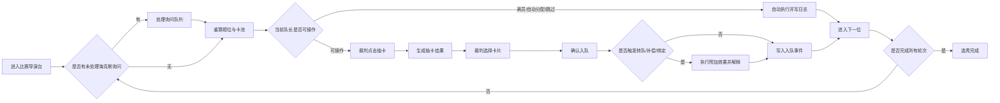

# HEXCORE 2.0 UI 重设计方案

归档状态：历史 UI 重设计方案，主要界面方向已落地为当前裁判控制台。本文保留设计过程和早期示意，不作为当前业务规则来源；现行业务规则以 `06_开发计划.md`、`14_阵营锁定10队金币商店模式_实施规范.md` 和最新海克斯指南为准。

## 1. 设计输入

### 1.1 项目现状

HEXCORE 2.0 当前是单端裁判控制台。裁判是唯一可写角色，负责导入选手、维护队伍、抽取和分配海克斯、主持轮抽、代队长抽卡选卡、修正规则冲突、导出日志和状态备份。

现有功能已经覆盖：

- 实时选秀：顺位、抽卡、选卡、海克斯、规则说明、事件日志、队伍横栏。
- 队伍管理：队伍数量、队长名称、基础顺位、补录队员、移除队员。
- 选手库：按状态和卡池筛选，编辑选手基础信息，禁用或恢复选手。
- 海克斯库：为队长抽取、分配、移除海克斯，查看手动和被动效果。
- 赛程进度：轮次矩阵、顺位展示、跳转指定轮次和队长。
- 规则设置：队伍数量、每队人数、轮次、每轮卡池、抽卡数、随机策略、超时策略、海克斯启用控制。
- 日志导出和系统设置：事件筛选、导出、清空、状态导入导出、本地重置、系统检查。

### 1.2 文章方法提炼

参考文章《超牛的 Claude Design 开源替代品来了！》提到的 Open Design 工作流，适合迁移到 HEXCORE 的不是“照搬工具界面”，而是其设计生产机制：

- 结构化问题表单：先确认目标平台、用户、调性、品牌上下文，再生成界面。
- 方向选择器：从预设视觉方向中选择并锁定色板、字体、间距、圆角和组件规则。
- Skill 模板：把 dashboard、mobile-app、critique、pm-spec 等任务变成可复用流程。
- 真实项目目录：让设计稿落到可维护的 HTML/CSS/JS 文件，而不是一次性图片。
- 实时 Todo：生成或执行时展示步骤进度，便于裁判确认系统在做什么。
- 沙盒预览：右侧即时预览、局部编辑、导出 HTML/PDF/PPTX/ZIP。
- 五维自评审：从设计理念、视觉层级、细节精度、功能性、创新性做质量检查。

HEXCORE 的 UI 重设计采用“Open Design 式控制台生成逻辑”：先锁定赛事控制台设计系统，再按裁判任务 Skill 拆页面，最后用自评审清单约束交互和视觉质量。

## 2. 重设计边界

### 2.1 保持一致

以下业务逻辑不改变：

- 当前采用阵营锁定 10 队金币商店模式，不再以无金币版规则作为现行规则来源。
- 顺位、金币商店、购买、刷新、海克斯、入队揭示、响应窗口和赛程记录沿用当前已落地引擎。
- 裁判代执行模式不变。
- 所有关键操作继续写入事件日志。
- 本地静态部署和状态导入导出能力不变。

### 2.2 新增/强化

- 海克斯启用状态升级为更明确的“规则开关中心”，支持按稀有度、手动/被动、风险等级筛选。
- 海克斯控制中心支持“默认启用池 / 备选池 / 已废弃金币规则”三类视图。
- 主工作台改为“当前任务优先”的比赛导演台，减少页面跳转。
- 引入操作队列，把本轮需要询问或确认的海克斯集中展示。
- 引入实时执行 Todo，把裁判操作拆成可验证步骤。
- 引入冲突解释层，顺位、卡池、海克斯冲突必须可追踪。
- 引入演示视图，为大屏或观众视图预留只读模式。

## 3. 设计系统

### 3.1 视觉方向

采用 Open Design 里的 Tech Utility 思路，但做成 HEXCORE 专属的“赛事裁判台”风格：冷静、高密度、低装饰、强状态反馈。

- 背景：近黑墨蓝，减少大面积纯黑压迫。
- 主面板：深海军蓝和炭灰，边框用低饱和冷灰。
- 主强调：电青色，只用于当前操作、可点击主动作、系统在线。
- 次强调：琥珀色，用于当前队长、顺位变化、待确认。
- 成功：绿色，用于入队完成、系统检查通过。
- 风险：红色，用于删除、重置、禁用、高风险撤销。
- 棱彩海克斯：只在海克斯卡片局部使用紫色，不作为全局主色。

### 3.2 信息层级

界面必须让裁判在 3 秒内回答四个问题：

- 现在轮到谁？
- 当前该做什么？
- 这个操作会影响什么？
- 出错后如何回退？

层级顺序：

1. 当前队长和当前任务。
2. 抽卡/选卡/海克斯确认主操作。
3. 顺位和卡池解释。
4. 队伍阵容和日志。
5. 规则、管理、导出等低频功能。

### 3.3 组件规则

- 主按钮只保留一个最高优先级动作，例如“抽卡”“确认选择”“进入下一位”。
- 高风险操作必须二次确认，并记录原因。
- 海克斯卡必须显示：启用状态、持有者、触发时机、剩余次数、是否被禁用或被潘多拉等效果压制。
- 顺位变化必须显示“基础顺位 + 海克斯修正 + 冲突裁决”。
- 日志默认倒序，支持按抽卡、入队、海克斯、修正、警告筛选。
- 不使用营销式大 Hero，不使用解释性大段文案，不把页面做成卡片套卡片。

## 4. 信息架构

```text
HEXCORE 裁判控制台
├─ 比赛导演台
│  ├─ 当前任务
│  ├─ 顺位链路
│  ├─ 抽卡与选卡
│  ├─ 本轮海克斯询问队列
│  ├─ 规则解释
│  ├─ 事件日志
│  └─ 队伍阵容横栏
├─ 编排中心
│  ├─ 赛程矩阵
│  ├─ 基础顺位
│  ├─ 补偿回合
│  └─ 跳转与修正
├─ 队伍与选手
│  ├─ 队伍管理
│  ├─ 选手库
│  ├─ 入队/移出
│  └─ 禁用/恢复
├─ 海克斯控制
│  ├─ 海克斯库
│  ├─ 持有关系
│  ├─ 启用/禁用
│  ├─ 触发队列
│  └─ 冲突解释
├─ 规则与模板
│  ├─ 赛事规则
│  ├─ 卡池顺序
│  ├─ 随机策略
│  ├─ 超时策略
│  └─ 模板保存
├─ 日志与回放
│  ├─ 事件日志
│  ├─ 操作快照
│  ├─ 撤销
│  └─ 导出
└─ 只读演示
   ├─ 大屏视图
   ├─ 观众视图
   └─ 队长预览视图
```

## 5. 全局布局

### 5.1 桌面端

```text
┌────────────────────────────────────────────────────────────────────────────┐
│ 顶部状态栏：赛事名 / 阶段 / 当前队长 / 当前任务 / 在线状态 / 时间 / 快捷操作 │
├──────────────┬─────────────────────────────────────────────┬───────────────┤
│ 左侧导航      │ 主工作区                                      │ 右侧事件轨     │
│              │ ┌─────────────────────────────────────────┐ │               │
│ 比赛导演台    │ │ 当前任务条 + 实时 Todo                   │ │ 筛选           │
│ 编排中心      │ ├─────────────────────────────────────────┤ │ 时间线         │
│ 队伍与选手    │ │ 顺位链路                                 │ │ 警告固定       │
│ 海克斯控制    │ ├───────────────────────┬─────────────────┤ │ 导出           │
│ 规则与模板    │ │ 抽卡/选卡主区           │ 海克斯询问/解释  │ │               │
│ 日志与回放    │ └───────────────────────┴─────────────────┘ │               │
│ 只读演示      │                                             │               │
├──────────────┴─────────────────────────────────────────────┴───────────────┤
│ 底部队伍阵容栏：所有队伍、人数进度、当前队长、异常状态、横向滚动             │
└────────────────────────────────────────────────────────────────────────────┘
```

### 5.2 小屏端

```text
┌──────────────────────────────┐
│ 顶部状态栏 + 横向导航         │
├──────────────────────────────┤
│ 当前任务条                    │
├──────────────────────────────┤
│ 顺位链路横滚                  │
├──────────────────────────────┤
│ 抽卡/选卡主区                 │
├──────────────────────────────┤
│ 海克斯询问队列                │
├──────────────────────────────┤
│ 队伍阵容横滚                  │
├──────────────────────────────┤
│ 事件日志折叠面板              │
└──────────────────────────────┘
```

## 6. 页面示意图与交互逻辑

### 6.1 比赛导演台

用途：裁判主持比赛的主界面，承载 80% 高频操作。

```text
┌────────────────────────────────────────────────────────────────────────────┐
│ HEXCORE 杯 S2  第 2/4 轮  当前：C7 神秘贤者  任务：等待抽卡  ● 进行中      │
├────────────────────────────────────────────────────────────────────────────┤
│ 当前任务                                                                   │
│ [1 本轮海克斯询问完成] [2 顺位已重算] [3 等待抽卡] [4 等待选卡] [5 入队]    │
├────────────────────────────────────────────────────────────────────────────┤
│ 顺位链路                                                                   │
│ C3 已完成 → C6 已完成 → C7 当前 → C2 待处理 → C1 待处理 → ...              │
│ 解释：基础蛇形顺位；启元插队；恶魔契约固定优先；满员队伍自动跳过             │
├──────────────────────────────────────────────┬─────────────────────────────┤
│ 抽卡区                                        │ 本轮海克斯询问               │
│ ┌──────────┐ ┌──────────┐ ┌──────────┐       │ [待答] 摄影艺术家 C12        │
│ │ 1 上路   │ │ 2 打野   │ │ 3 中路   │       │   本轮池与下轮池互换          │
│ │ 青山隐   │ │ 林深见鹿 │ │ 云外之人 │       │   [使用] [跳过]              │
│ │ 评分 78 │ │ 评分 85 │ │ 评分 72 │       │ [可用] 致盲吹箭 C6           │
│ └──────────┘ └──────────┘ └──────────┘       │   选择目标：[C1][C2][C7]      │
│ [抽卡] [确认选择] [超时随机] [跳过] [下一位] │                             │
├──────────────────────────────────────────────┴─────────────────────────────┤
│ 队伍阵容：C1 2/4 | C2 1/4 | C3 3/4 | C4 2/4 | C5 1/4 | C6 2/4 | C7 0/4   │
└────────────────────────────────────────────────────────────────────────────┘
```

关键交互：

- 进入页面时自动计算当前任务：若存在未处理 PromptEffect，主按钮显示“处理询问”；否则根据状态显示“抽卡”“确认选择”或“进入下一位”。
- 点击“抽卡”前检查比赛是否完成、当前队长是否存在、队伍是否满员、是否存在自动分配海克斯。
- 抽卡后卡片进入可选状态，默认选中第一张，裁判可点击切换。
- 点击“确认选择”后执行 Assignment Engine，写入事件，若是盲盒转队则同步生成补偿回合。
- 点击“下一位”会清空当前抽卡结果，推进 Turn Order Engine，并刷新顺位解释。
- 所有禁用按钮必须显示原因，例如“潘多拉魔盒压制”“当前不是第 1 轮”“队伍已满”。

### 6.2 编排中心

用途：处理顺位、赛程、补偿回合和裁判跳转。

```text
┌────────────────────────────────────────────────────────────────────────────┐
│ 编排中心                                      [重算顺位] [保存赛程快照]     │
├────────────────────────────────────────────────────────────────────────────┤
│ 指标：当前轮 2/4 | 有效队伍 12 | 已入队 11 | 补偿回合 1 | 异常 0           │
├────────────────────────────────────────────────────────────────────────────┤
│ 赛程矩阵                                                                   │
│ 队长        第1轮        第2轮        第3轮        第4轮                   │
│ C1 夜阑     已完成       待处理       待处理       待处理                  │
│ C2 星海     已完成       待处理       待处理       待处理                  │
│ C7 神秘贤者 已完成       当前         待处理       待处理                  │
│ C5 无痕     自动分配     补偿待处理   待处理       待处理                  │
├────────────────────────────────────────────────────────────────────────────┤
│ 基础顺位编辑：C1 ↑ ↓ 位置[1] | C2 ↑ ↓ 位置[2] | C3 ↑ ↓ 位置[3]             │
├────────────────────────────────────────────────────────────────────────────┤
│ 裁判跳转：轮次[2] 队长[C7 神秘贤者] 原因[线下仲裁修正] [确认跳转]           │
└────────────────────────────────────────────────────────────────────────────┘
```

关键交互：

- 修改基础顺位、轮次跳转、补偿回合处理都必须先创建撤销快照。
- 跳转操作需要填写原因，事件类型为 `REFEREE_OVERRIDE` 或“赛程跳转”。
- 顺位矩阵不只显示状态，还显示状态来源：正常、海克斯、自动分配、补偿、满员跳过。
- 鼠标悬停某个单元格显示该回合的卡池、持有海克斯、执行事件摘要。

### 6.3 队伍与选手

用途：维护队伍、队长、选手库和手动补录。

```text
┌────────────────────────────────────────────────────────────────────────────┐
│ 队伍与选手                         [新增队伍] [新增选手] [批量导入]        │
├───────────────────────────────┬────────────────────────────────────────────┤
│ 队伍列表                       │ 选手库                                     │
│ ┌───────────────────────────┐ │ 筛选：[全部][可选][已入队][禁用][1][2][3][4]│
│ │ C7 神秘贤者  当前 0/4     │ │ ┌────────────────────────────────────────┐ │
│ │ 顺位 7  海克斯 3          │ │ │ 青山隐 上路 QS_Yin 评分78 中等马 可选  │ │
│ │ [设为当前] [补录] [改名]  │ │ │ [保存] [禁用] [加入 C7]                │ │
│ └───────────────────────────┘ │ └────────────────────────────────────────┘ │
│ ┌───────────────────────────┐ │ ┌────────────────────────────────────────┐ │
│ │ C3 烬灭 3/4               │ │ │ 已选七 上路 Team_G 评分86 上等马 已入队│ │
│ │ 成员：已选四/已选五/已选六│ │ │ 归属：C4 龙牙  [移回可选池]            │ │
│ └───────────────────────────┘ │ └────────────────────────────────────────┘ │
└───────────────────────────────┴────────────────────────────────────────────┘
```

关键交互：

- 队伍列表默认按当前顺位排序，当前队长固定高亮。
- 队伍人数达到上限后，补录和入队按钮禁用。
- 已入队选手不能直接禁用，必须先移回可选池。
- 任何补录都必须写入“裁判修正/补录”事件，和正常抽卡入队区分。
- 批量导入要先预检：重复 ID、非法 tier、评分缺失、队伍容量溢出。

### 6.4 海克斯控制

用途：集中查看海克斯定义、启用状态、持有关系、触发队列和冲突。

```text
┌────────────────────────────────────────────────────────────────────────────┐
│ 海克斯控制                  [为当前队长抽取] [批量启用] [批量禁用]          │
├────────────────────────────────────────────────────────────────────────────┤
│ 筛选：[全部][手动][被动][青铜/功能][黄金/干扰][棱彩/强力][已禁用][冲突中]  │
├────────────────────────────────────────────────────────────────────────────┤
│ 当前队长：C7 神秘贤者                                                      │
│ 已持有：启元 可用 | 双发快射 可用 | 神秘贤者·盲盒 可用                     │
├────────────────────────────────────────────────────────────────────────────┤
│ 海克斯库                                                                   │
│ ┌──────────────────────────┐ ┌──────────────────────────┐                  │
│ │ 启元             启用中  │ │ 潘多拉魔盒       启用中  │                  │
│ │ 类型：手动 / 青铜        │ │ 类型：被动 / 棱彩        │                  │
│ │ 触发：每轮询问           │ │ 固定第3顺位，自动分配    │                  │
│ │ [分配给 C7] [禁用]       │ │ [分配给 C7] [禁用]       │                  │
│ └──────────────────────────┘ └──────────────────────────┘                  │
├────────────────────────────────────────────────────────────────────────────┤
│ 冲突解释                                                                   │
│ C5 无痕：潘多拉魔盒启用，压制开饭啦/启元等自主选人类效果。                  │
└────────────────────────────────────────────────────────────────────────────┘
```

关键交互：

- “启用/禁用”只改变规则开关，不删除任何已分配记录。
- 禁用某海克斯后，后续抽取候选排除该海克斯；已持有但被禁用的海克斯显示“规则禁用”。
- 若海克斯被其他效果压制，状态显示“失效”，不同于“已禁用”。
- 使用目标型海克斯时，目标选择必须内嵌在卡片内，例如致盲选择队长、锁定契约选择两名选手、顺位互换选择两名队长。
- 海克斯执行结果必须同步出现在事件日志和冲突解释中。

### 6.5 规则与模板

用途：维护赛事参数，并保存可复用规则模板。

```text
┌────────────────────────────────────────────────────────────────────────────┐
│ 规则与模板                                    [保存规则] [保存为模板]       │
├────────────────────────────────────────────────────────────────────────────┤
│ 队伍数量 [12]  每队人数 [4]  最大轮数 [4]  当前轮次 [2]  基础抽卡 [3]      │
│ 自动随机策略 [均衡随机]  超时策略 [随机可选]                               │
├────────────────────────────────────────────────────────────────────────────┤
│ 每轮卡池顺序                                                               │
│ 第1轮 [侏儒马]  第2轮 [中等马]  第3轮 [上等马]  第4轮 [猛犸]               │
├────────────────────────────────────────────────────────────────────────────┤
│ 海克斯启用总览                                                             │
│ 启元 启用 | 致盲吹箭 启用 | 潘多拉魔盒 启用 | 摄影艺术家 禁用              │
├────────────────────────────────────────────────────────────────────────────┤
│ 已保存模板                                                                 │
│ S2 标准  12队 / 每队4人 / 4轮 / 全海克斯启用                               │
│ 测试小局  6队 / 每队3人 / 3轮 / 禁用转队类海克斯                           │
└────────────────────────────────────────────────────────────────────────────┘
```

关键交互：

- 保存规则前弹出影响摘要：会重算顺位、清空当前抽卡结果、保留已入队成员。
- 队伍数量减少时，必须提示被删除队伍的选手会回到可选池。
- 卡池顺序变更后，Pool Engine 解释必须立即更新。
- 模板保存只保存规则参数和禁用海克斯，不保存当前比赛进度。

### 6.6 日志与回放

用途：审计、导出、撤销、复盘。

```text
┌────────────────────────────────────────────────────────────────────────────┐
│ 日志与回放                         [导出日志] [导出状态] [清空日志]        │
├────────────────────────────────────────────────────────────────────────────┤
│ 筛选：[全部][抽卡][入队][海克斯][修正][警告]  搜索：[C7 / 启元 / 盲盒]      │
├───────────────────────────────┬────────────────────────────────────────────┤
│ 事件时间线                     │ 事件详情                                   │
│ 19:42 抽卡完成                 │ 标题：抽卡完成                             │
│ 19:43 选手入队                 │ 内容：C7 从中等马池抽取 3 张选手卡          │
│ 19:44 海克斯使用               │ 影响：currentDraw 更新，selectedSlot=0     │
│ 19:45 裁判修正                 │ [复制摘要] [定位到相关队伍] [生成复盘记录] │
├───────────────────────────────┴────────────────────────────────────────────┤
│ 撤销快照：抽卡前 C7 | 使用海克斯前 C6 | 规则设置保存前                    │
└────────────────────────────────────────────────────────────────────────────┘
```

关键交互：

- 事件筛选不影响导出的原始数据，导出时可选择“当前筛选结果”或“完整日志”。
- 撤销必须展示快照标签和影响范围。
- 清空日志只清空事件列表，不改变比赛状态；需要二次确认。
- 回放模式只读，逐步应用事件，用于赛后复盘和 bug 复现。

### 6.7 只读演示

用途：为未来大屏、观众和队长端预留视图，不开放写操作。

```text
┌────────────────────────────────────────────────────────────────────────────┐
│ 只读演示：大屏视图                                            [复制链接]   │
├────────────────────────────────────────────────────────────────────────────┤
│ 当前轮次：第2轮          当前队长：C7 神秘贤者          比赛进行中          │
├────────────────────────────────────────────────────────────────────────────┤
│ 顺位：C3 → C6 → C7 → C2 → C1 → C8 → ...                                    │
├────────────────────────────────────────────────────────────────────────────┤
│ 公开抽卡结果：根据可见性规则展示；致盲、暗牌、未揭示身份不显示真实信息       │
├────────────────────────────────────────────────────────────────────────────┤
│ 队伍阵容榜：队伍、已入队人数、公开成员、公开海克斯                          │
└────────────────────────────────────────────────────────────────────────────┘
```

关键交互：

- 只读演示不允许抽卡、选卡、使用海克斯、撤销、导入、重置。
- 视图必须读取 Visibility Engine 的输出，而不是直接读取真实 `playerId`。
- 裁判端可以切换“裁判全量视图”和“队长可见预览”，提前验证暗信息规则。

## 7. 核心状态机



## 8. Open Design 式内置工具面板

建议新增一个不干扰比赛的“设计/质检抽屉”，只给管理员使用：

```text
┌──────────────────────────────────────┐
│ UI 生成与质检                         │
├──────────────────────────────────────┤
│ 目标平台：[桌面裁判台][移动裁判助手]  │
│ 设计方向：[Tech Utility]              │
│ Skill：[dashboard][critique][pm-spec] │
│ 设计系统：[HEXCORE Referee Console]   │
├──────────────────────────────────────┤
│ 自检清单                              │
│ ✓ 当前任务是否明确                    │
│ ✓ 主操作是否唯一                      │
│ ✓ 禁用原因是否可见                    │
│ ✓ 海克斯冲突是否解释                  │
│ ✓ 小屏是否可用                        │
├──────────────────────────────────────┤
│ [生成页面草案] [运行五维评审] [导出方案]│
└──────────────────────────────────────┘
```

这不是比赛期间的核心功能，而是让后续 UI 迭代能遵循固定流程，避免每次改版都凭感觉重做。

## 9. 五维评审标准

### 9.1 设计理念

- 是否服务裁判现场执行，而不是展示型页面。
- 是否保留未来多人端的可见性边界。
- 是否把海克斯规则复杂度转化为可解释信息。

### 9.2 视觉层级

- 当前队长、当前任务、主按钮是否最醒目。
- 顺位、卡池、海克斯、日志是否能被快速扫描。
- 危险操作是否和普通操作有明显区别。

### 9.3 细节精度

- 禁用按钮是否说明原因。
- 每个状态是否有明确文案：可用、已使用、被动、已禁用、被压制、待询问。
- 长队长名、长选手名、长海克斯名是否不撑破布局。

### 9.4 功能性

- 裁判是否能在一个页面完成标准轮抽。
- 修改规则是否能重算并保留可撤销快照。
- 日志是否足以复盘争议操作。

### 9.5 创新性

- 是否把 Open Design 的结构化表单、Skill、自评审转化为项目内可复用机制。
- 是否有只读演示和队长可见预览，为未来多人版铺路。
- 是否把“复杂海克斯”变成可解释、可审计的操作队列。

## 10. 分阶段落地建议

### 第一阶段：不动引擎，只重组主工作台

- 重构比赛导演台布局。
- 新增当前任务条和实时 Todo。
- 将海克斯询问从普通卡片列表升级为队列。
- 优化禁用按钮原因和冲突解释。

### 第二阶段：强化规则和海克斯控制

- 将海克斯启用/禁用从规则页拆成独立控制中心。
- 支持海克斯风险等级、触发时机、持有者筛选。
- 增加冲突解释面板。

### 第三阶段：日志回放和只读演示

- 增加事件详情、搜索、回放模式。
- 增加大屏只读视图。
- 增加队长可见预览，验证暗牌和致盲规则。

### 第四阶段：Open Design 式设计工具化

- 增加 UI 质检抽屉。
- 固化 HEXCORE 设计系统文档。
- 为 dashboard、mobile、spectator、critique 建立本地 Skill 模板。
