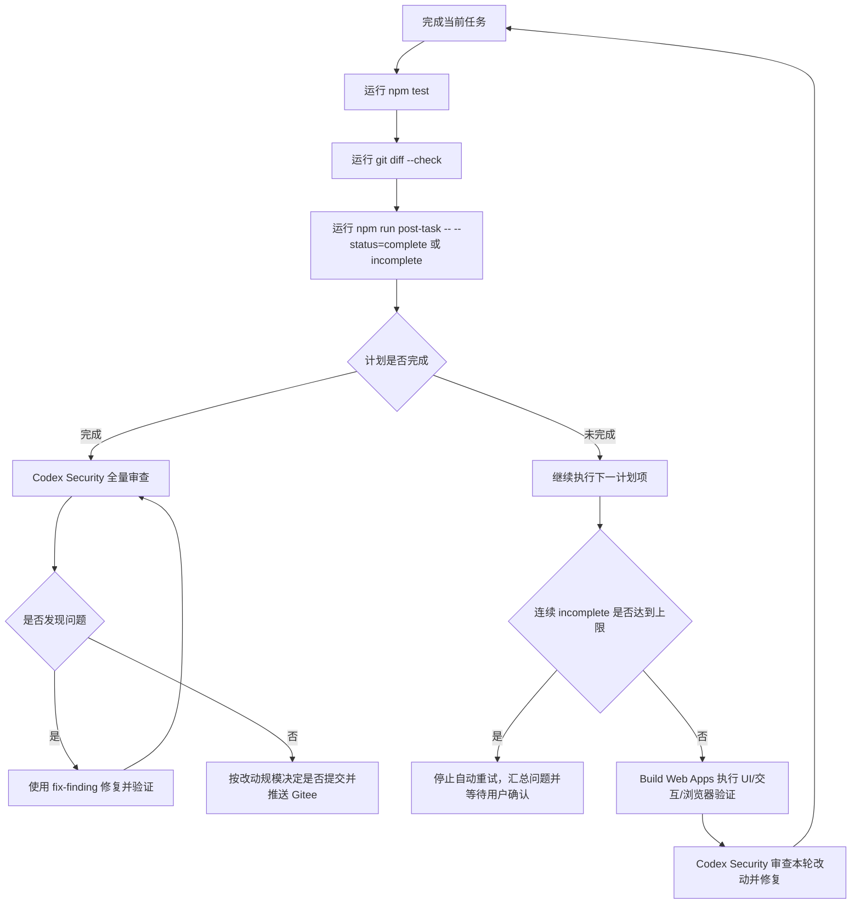

# 任务后置钩子

## 目标

在每次完成当前任务后，用固定流程判断下一步：

- 计划已完成：全量安全审查、修复、验证，通过后按需推送 Gitee。
- 计划未完成：继续执行下一项计划，并在较大改动后做安全审查。

## 标准流程



## 本地机械门禁

```powershell
npm test
git diff --check
npm run post-task -- --status=incomplete
```

默认同一任务文档连续 `incomplete` 最多允许 5 次。确需临时调整时：

```powershell
npm run post-task -- --status=incomplete --max-attempts=3
```

当阶段闭环确认完成时：

```powershell
npm run post-task -- --status=complete
```

## Codex 执行规则

`post-task` 脚本不能替代模型级安全审查，但它必须作为任务文档驱动的执行循环入口。它负责：

- 读取任务文档，默认读取 `docs/06_开发计划.md`。
- 提取目标、禁止/约束、验收/完成标准、推荐执行顺序和当前状态线索。
- 自动运行 `npm test`。
- 自动运行 `git diff --check`。
- 检查工作树状态和当前分支。
- 提取文档中的未勾选清单、阻断、待处理、尚未完成等线索。
- 记录同一任务文档连续 `incomplete` 次数，超过上限时失败退出，防止无限循环。
- 当 `--status=complete` 但仍存在失败门禁、未勾选清单或阻断线索时，脚本必须失败退出。
- 提醒是否进入全量安全审查、前端验证、修复和推送流程。

也可以显式指定任务文档：

```powershell
npm run post-task -- --doc=docs/13_四轮金币抽卡模式_实施修改方案.md --status=incomplete
```

真正的代码安全审查必须由 Codex Security 技能按阶段执行：

1. 威胁建模。
2. 发现候选安全问题。
3. 验证问题是否成立。
4. 分析攻击路径和严重性。
5. 对成立问题做修复和验证。

## complete 约束

`--status=complete` 只表示“申请完成”。脚本会做机械判断：

- `npm test` 必须通过。
- `git diff --check` 必须通过。
- 任务文档中不能存在未勾选 Markdown 清单。
- 任务文档中不能存在环境阻断、待处理、尚未完成、等待用户、失败、TODO 等阻断线索。

机械判断通过后，仍必须执行 Codex Security 与必要的 Build Web Apps 前端验证。只有审查和修复闭环后，才允许提交或推送。

## incomplete 上限

`--status=incomplete` 表示继续推进，但不是无限重试许可：

- 默认上限：同一任务文档连续 5 次 `incomplete`。
- 超过上限：脚本失败退出，Codex 必须停止自动执行并汇总剩余问题。
- 状态存储：脚本按任务文档记录连续次数；`complete` 通过后自动清零。
- 可调参数：`--max-attempts=<次数>` 或环境变量 `POST_TASK_MAX_ATTEMPTS`，值必须是大于 0 的整数。
- 状态文件：默认写入系统临时目录；测试或特殊场景可用 `--state-file=<路径>`，路径必须位于项目目录或系统临时目录内。

## 推送策略

- 小修小补不立即推送。
- 阶段闭环、核心引擎改动、导入/导出/安全边界改动、部署脚本改动，应视为较大改动。
- 推送前必须确认不包含无关未跟踪文件。
