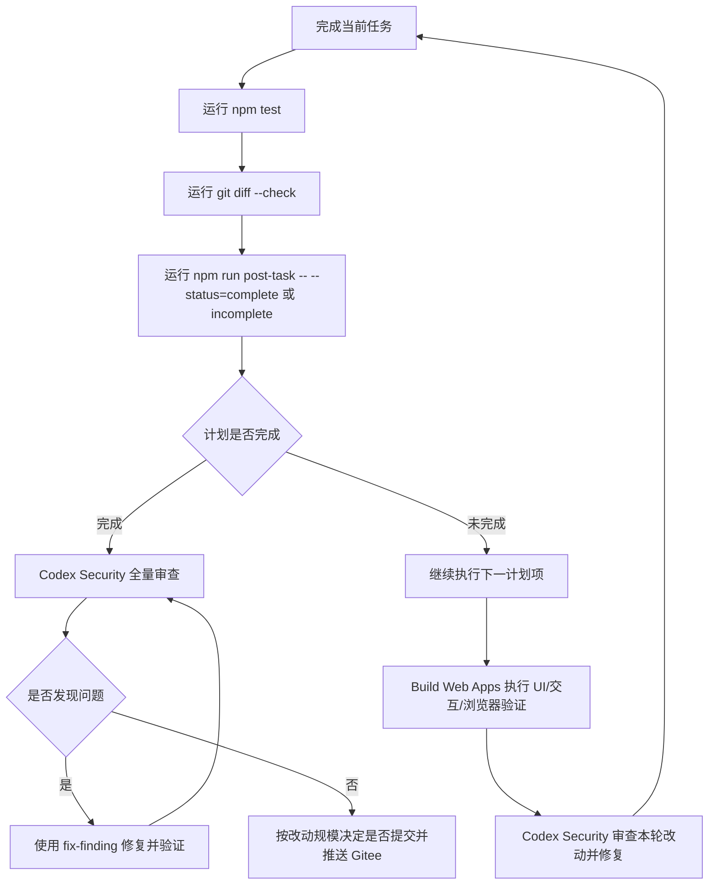

# 任务后置钩子

## 目标

在每次完成当前任务后，用固定流程判断下一步：

- 计划已完成：全量安全审查、修复、验证，通过后按需推送 Gitee。
- 计划未完成：继续执行下一项计划，并在较大改动后做安全审查。

## 标准流程



## 本地机械门禁

```powershell
npm test
git diff --check
npm run post-task -- --status=incomplete
```

当阶段闭环确认完成时：

```powershell
npm run post-task -- --status=complete
```

## Codex 执行规则

`post-task` 脚本不能替代模型级安全审查。它只负责：

- 确认本地测试入口存在。
- 检查工作树状态。
- 输出当前分支路线。
- 提醒是否进入全量安全审查、修复和推送流程。

真正的代码安全审查必须由 Codex Security 技能按阶段执行：

1. 威胁建模。
2. 发现候选安全问题。
3. 验证问题是否成立。
4. 分析攻击路径和严重性。
5. 对成立问题做修复和验证。

## 推送策略

- 小修小补不立即推送。
- 阶段闭环、核心引擎改动、导入/导出/安全边界改动、部署脚本改动，应视为较大改动。
- 推送前必须确认不包含无关未跟踪文件。
