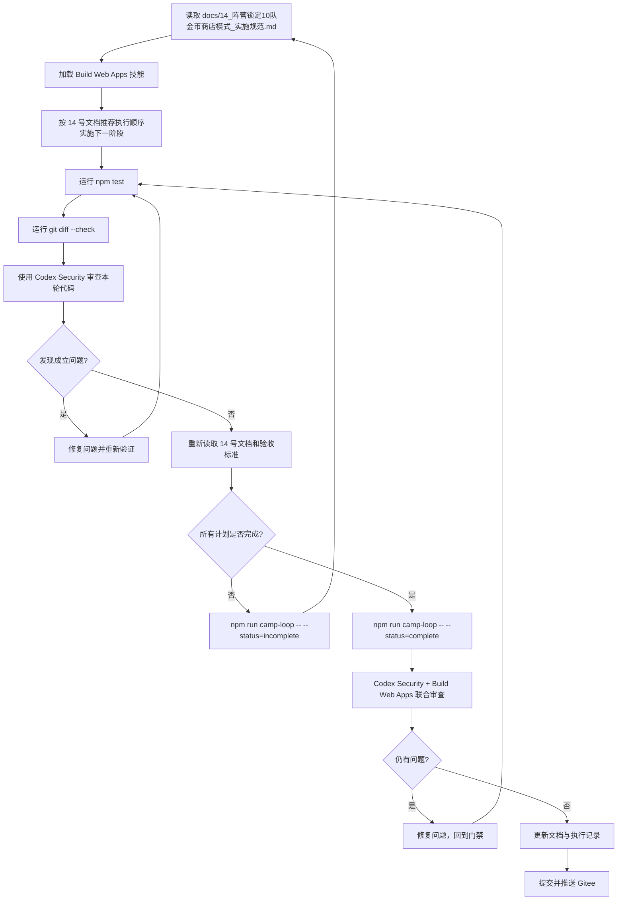

# 阵营锁定实施循环钩子

本文档定义 `docs/14_阵营锁定10队金币商店模式_实施规范.md` 的循环实施钩子。后续 Codex 执行该大型改造时，必须先读取 14 号实施规范，再按本文循环推进。

## 目标

让 Codex 以固定循环推进阵营锁定 10 队金币商店模式，直到 14 号文档中的计划和验收标准全部完成。

## 入口命令

计划未完成时运行：

```powershell
npm run camp-loop -- --status=incomplete
```

计划全部完成时运行：

```powershell
npm run camp-loop -- --status=complete
```

该脚本只做机械门禁提示和必要文件检查，不能替代模型级执行、Build Web Apps 审查或 Codex Security 审查。

## 固定循环



## 执行规则

每一轮必须遵守：

- 先读取 14 号实施规范，不能只凭上一轮记忆继续开发。
- UI、交互、浏览器验证相关任务必须使用 Build Web Apps 技能或等效前端验证流程。
- 安全审查必须使用 Codex Security 技能，至少覆盖本轮改动；计划完成时必须做全量审查。
- 安全审查发现成立问题时，必须修复并重新运行本地门禁。
- 不得为了推进计划而放宽 14 号文档规则。
- 不得跳过 `npm test` 和 `git diff --check`。
- 不得提交无关文件或临时产物。

## 完成判定

只有同时满足以下条件，才允许使用 `--status=complete`：

- 14 号文档第 13 节“验收标准”全部满足。
- 14 号文档第 14 节“推荐执行顺序”全部完成。
- `npm test` 通过。
- `git diff --check` 通过。
- Codex Security 本轮审查无未修复成立问题。
- Build Web Apps 或等效前端验证确认主要页面可用。

如果完成状态无法可靠判断，默认使用：

```powershell
npm run camp-loop -- --status=incomplete
```

## 完成后的联合审查

当 `--status=complete` 后，执行 Codex 必须：

1. 使用 Codex Security 做全量安全审查。
2. 使用 Build Web Apps 做 UI、交互、浏览器验证审查。
3. 修复所有成立问题。
4. 更新 `docs/14_阵营锁定10队金币商店模式_实施规范.md` 的实施状态或补充说明。
5. 更新 `docs/09_执行记录.md`。
6. 再次运行 `npm test` 和 `git diff --check`。
7. 提交并推送 Gitee。

## Gitee 提交约束

提交前必须确认：

- 当前分支正确。
- 没有无关未跟踪文件。
- 文档、代码、测试改动都属于阵营锁定实施范围。
- 最后一轮门禁通过。

提交信息建议：

```text
feat: implement camp locked gold shop mode
```

